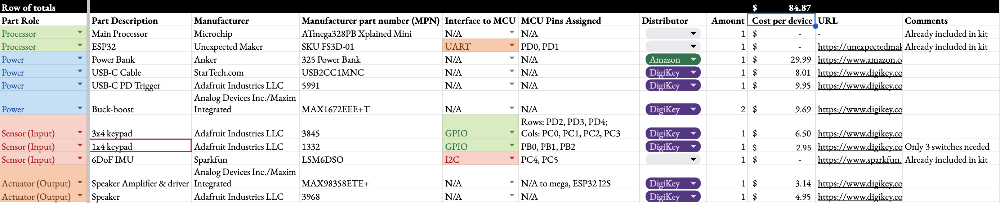
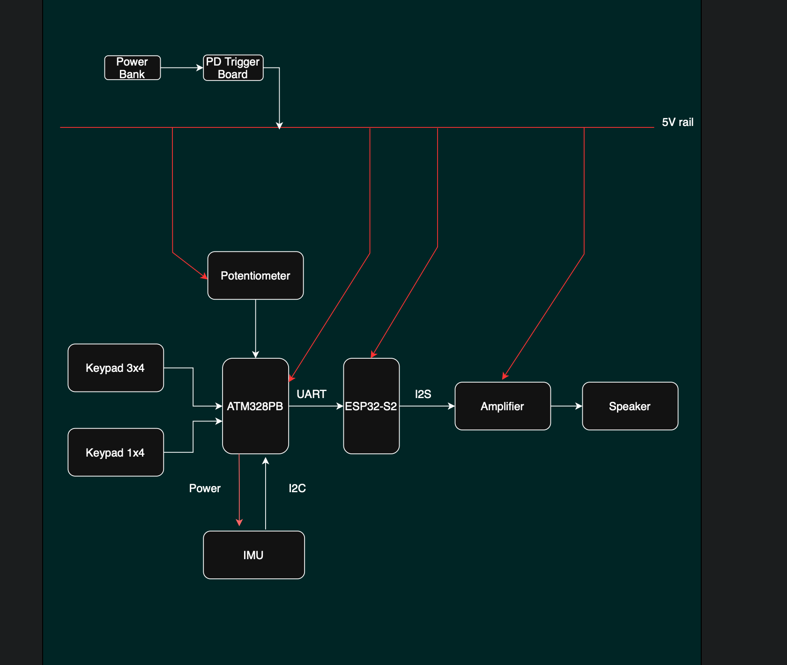
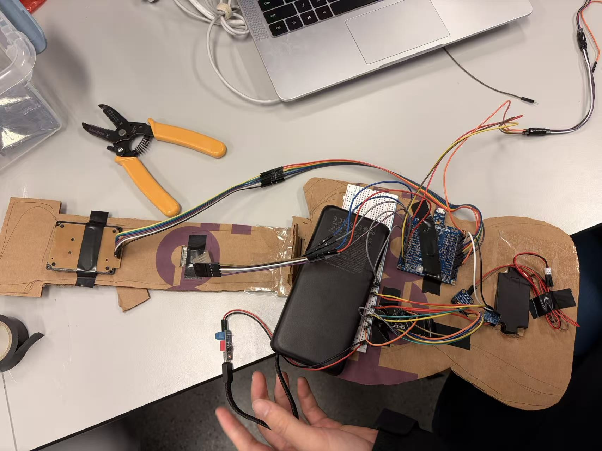

[](https://classroom.github.com/a/a-5mB3GB)

# Final Project — T28 Minus.5

**Team Number: #28**

**Team Name: Minus.5**

| Team Member Name |     Email Address     |
| :--------------: | :--------------------: |
|    Yibo Wang    | yibo08@seas.upenn.edu |
|   Zicong Zhang   | zhang89@seas.upenn.edu |
|   Xiuwen Zheng   | xiuwenz@seas.upenn.edu |

**GitHub Repository URL: https://github.com/upenn-embedded/final-project-f25-f25_final_project_t28_minus-5.git [(Click at here)](https://github.com/upenn-embedded/final-project-f25-f25_final_project_t28_minus-5.git)**

**GitHub Pages Website URL:** [for final submission]*

## Final Project Proposal

### 1. Abstract

Air Guitar is a wearable-plus-handheld instrument that lets anyone strum convincing guitar sounds with zero prior training. The left hand selects chords via a 3×4 button matrix (+ two modifier keys), while the right hand wears an IMU glove that detects up/down strums and intensity. An ATmega328PB (bare-metal C) performs sensing and event detection, then streams events over UART to an ESP32 that synthesizes guitar tone (Karplus-Strong or a lightweight wavetable) and outputs audio via **I2S → class-D speaker amp**.The whole system is packaged in a compact 3D-printed guitar body with integrated power, speaker, and tidy wiring.

### 2. Motivation

**Problem:** Traditional guitars demand months of practice (chord shapes, timing, right-hand technique). Beginners often stall at the barrier to entry.

**Goal:** Make guitar performance **simple, playful, and immediate->**

* **Fixed, musically sound chord presets** so beginners always sound good.
* **Fun strumming triggers** (IMU-based) that feel natural—up/down/intensity with velocity.
* **“Auto” key** that steps through a pre-arranged chord progression, enabling **one-button sing-along** (great for open-mic, classroom, or party settings).

**Why interesting:**

* Low-cost on-ramp to music-making; less pressure, more joy.
* Useful for **music education**, therapy, and quick prototyping of song ideas.
* Socially sticky: instant accompaniment for singers; yes, potentially a low-effort way to “impress your crush.”
* In short: **accessibility, convenience, and delight** —turn hesitation into participation.

### 3. System Block Diagram

.png)

Our system consists of an  ATmega microcontroller , an IMU sensor for motion detection, and an ESP32 microcontroller for audio generation and playback.   The IMU captures the user's strumming and gesture motions, which are processed by the ATmega to extract chord and strumming information.   This data is then transmitted to the ESP32, which interprets the inputs and generates corresponding guitar sound samples to emulate realistic guitar tones.

Communication between the ATmega and the IMU is handled via  I²C , while data transmission between the ATmega and ESP32 uses UART (or another serial protocol).   Audio output is generated through the ESP32's DAC pin, amplified, and then sent to a small speaker.   Interrupts on the ATmega may be used to detect strumming events in real time, ensuring low-latency response.

The system is powered by a 5V output from a PD trigger board connected to a portable power bank. The 5V rail directly supplies the keypad and ATmega and is further regulated down to 3.3V using an DC-DC converter to power the ESP32, amplifier and IMU modules.

### 4. Design Sketches

**Product Prototype Concept Preview:**


**Look & Feel:** A compact, stylized guitar silhouette, **3D-printed** in two shells (body + neck). The right-hand **IMU glove** uses a soft strap and small sensor puck.

**Critical features:**

* **Integrated electronics** : ATmega board, ESP32 board, I2S amp (e.g., MAX98357A), full-range speaker, 3×4 chord buttons + 2 modifiers (ALT1: M7/m7; ALT2: sus2/sus4) + 1 auto-key.
* **Cable management** : internal channels and standoffs for boards; JST headers for serviceability.
* **Power** : 5 V source (USB-C power bank + PD trigger board pack with 3.3 V Buck-Boost). Isolated grounds and short I2S runs to minimize noise.

**Manufacturing:**

* **3D printing** for body + neck modules (PLA/PETG). Brass heat-inserts for screw posts.
* Optional **laser-cut** backplate for quick access.
* Basic hand tools (soldering iron, crimper) for harnesses.

**Why 3D printing:**

* One-piece enclosure improves durability, acoustics (internal volume) and **wiring optimization** (fewer external cables).
* Easy to iterate mounting holes, airflow, and speaker porting.

### 5. Software Requirements Specification (SRS)

#### 5.1 Definitions, Abbreviations

* **IMU** — Inertial Measurement Unit, used to detect hand movement and classify strumming gestures.
* **Keypad** — Button matrix used to select chords.
* **ATmega328PB** — Microcontroller that collects input data and sends commands to ESP32.
* **ESP32** — Microcontroller responsible for generating or playing guitar sounds.
* **I²C (Inter-Integrated Circuit)** — Protocol used for communication between ATmega and sensors/keypad.
* **UART** — Serial communication interface used between ATmega and ESP32.
* **I²S (Integrated Interchip Sound)** — Protocol for digital audio transmission from ESP32 to speaker driver.
* **DAC (Digital-to-Analog Converter)** — Converts digital audio signals into analog sound signals.

#### 5.2 Functionality

| **ID**     | **Description**                                                                                                                                             |
| ---------------- | ----------------------------------------------------------------------------------------------------------------------------------------------------------------- |
| **SRS-01** | The IMU 3-axis acceleration and angular velocity shall be measured successfully, and the data shall be used to detect four types of strumming gestures (up/down). |
| **SRS-02** | The keypad shall continuously scan chord inputs successfully. The system shall recognize and switch to a chord while pressing a key.                             |
| **SRS-03** | The ATmega328PB shall transmit chord and strumming data (note On events) to the ESP32 via UART with a success rate of at least 99%.                             |
| **SRS-04** | The ESP32 shall receive chord notes and select the correct guitar sound sample to play through the I²S audio interface.                                        |
| **SRS-05** | The ESP32 shall map the correct note types to corresponding audio playback modes to produce realistic guitar strumming sounds.                                   |
| **SRS-06** | The system shall remain operational for at least 30 minutes of continuous use without system crash, freezing, or data loss.                                       |
| **SRS-07** | The ESP32 shall output audio via I²S to a speaker driver, and the generated sound amplitude shall be verified to match expected guitar sound patterns within.   |

### 6. Hardware Requirements Specification (HRS)

The Air Guitar System integrates sensing, processing, and audio subsystems into a compact, battery-powered device. Its purpose is to detect hand gestures and chord selections and synthesize guitar-like sounds in real time. The hardware must provide reliable performance, portability, and testable metrics for power, latency, and audio quality.

#### 6.1 Definitions, Abbreviations

* **IMU** — Inertial Measurement Unit, used to detect hand movement and classify strumming gestures.
* **Keypad** — Button matrix used to select chords.
* **ATmega328PB** — Microcontroller that collects input data and sends commands to ESP32.
* **ESP32** — Microcontroller responsible for generating or playing guitar sounds.
* **I²C (Inter-Integrated Circuit)** — Protocol used for communication between ATmega and sensors/keypad.
* **UART** — Serial communication interface used between ATmega and ESP32.
* **I²S (Integrated Interchip Sound)** — Protocol for digital audio transmission from ESP32 to speaker driver.
* **DAC (Digital-to-Analog Converter)** — Converts digital audio signals into analog sound signals.

#### 6.2 Functionality

##### 6.2.1 Control and Processing Subsystem

| ID               | Description                                                                                                                                                                                                                        | Validation                                                                  |
| ---------------- | ---------------------------------------------------------------------------------------------------------------------------------------------------------------------------------------------------------------------------------- | --------------------------------------------------------------------------- |
| **HRS-01** | The**ATmega328PB** serves as the main controler to handle all input acquisition and **IMU** sampling at ≥ 200 Hz, transmitting encoded data to the ESP32 via UART (115200 bps). Total data latency shall be ≤ 10 ms. | Log IMU trigger timestamps and UART receive timestamps; check Δt ≤ 10 ms. |
| **HRS-02** | The**ESP32** shall receive UART data, synthesize audio using the **Karplus-Strong or wavetable algorithm**, and output 16-bit, 44.1 kHz I²S audio. End-to-end latency shall be ≤ 20 ms.                              | Compare input trigger vs. audio playback timestamp in serial log.           |
| **HRS-03** | Both MCUs shall implement UART buffering to ensure 0 % packet loss during bursts exceeding 10 events/s.                                                                                                                            | Send burst test log from ATmega; confirm identical receive log on ESP32.    |

---

##### 6.2.2 Power Subsystem

| ID               | Description                                                                                                      | Validation                                                           |
| ---------------- | ---------------------------------------------------------------------------------------------------------------- | -------------------------------------------------------------------- |
| **HRS-04** | A power bank of 2000 mAh shall power the system for ≥ 2 hours under typical 300 mA load.                        | Operate full system until shutdown; measure duration with USB meter. |
| **HRS-05** | The selected**Type-C PD trigger board** shall negotiate 5 V / 9 V PD output with ± 5 % voltage tolerance. | Confirm voltage output with voltmeter under load.                    |

---

##### 6.2.3 Left-Hand Input Subsystem

| ID               | Description                                                                                                                          | Validation                                                  |
| ---------------- | ------------------------------------------------------------------------------------------------------------------------------------ | ----------------------------------------------------------- |
| **HRS-06** | The chord input pad shall use a**3 × 4 matrix (12 keys)**, supporting 12 chord selections for each chord group.               | Verify keypress + chord code via serial monitor.            |
| **HRS-07** | The variation keys and auto key shall use three keys in a 1 x 4 matrix keypad, supporting selection of 2 chord groups and auto mode. | Verify keypress outputs expected group/mode via serial log. |

---

##### 6.2.4 Right-Hand Motion Sensing Subsystem

| ID               | Description                                                                                                                | Validation                                                  |
| ---------------- | -------------------------------------------------------------------------------------------------------------------------- | ----------------------------------------------------------- |
| **HRS-09** | A 6-DOF**IMU** shall capture strumming motion via I²C at 400 kHz. Gyroscope range: ± 500 °/s, noise < 5 °/s RMS. | Log strumming motion; check responsiveness and noise level. |

---

##### 6.2.5 Sound Output Subsystem

| ID               | Description                                                                                                                                                                                                 | Validation                                                        |
| ---------------- | ----------------------------------------------------------------------------------------------------------------------------------------------------------------------------------------------------------- | ----------------------------------------------------------------- |
| **HRS-10** | The (Audio Amplifier / Driver)**MAX98357A Class-D I²S amplifier** shall convert 16-bit / 44.1 kHz digital audio to analog, driving a **4 Ω / 3 W speaker**. Efficiency ≥ 85 %, THD+N ≤ 1 %. | Measure output swing + distortion using audio test file playback. |

### 7. Bill of Materials (BOM)

When choosing specific components to purchase, we consider latency, input robustness, output quality, safety, budget, easy-to-use. The following are parts chosed based on the above factors.

#### Control & Processing

1. **ATmega328PB Xplained Mini (Main Controller)**

* **Why:** Easy to access (already provided). Runs the bare-metal, register-level firmware for left-hand keypad scanning (≥100 Hz), IMU polling (≥200 Hz), debounce, UART event packing, I2C. Also, the size is small for us to build a portable product

2. **ESP32 (Unexpected Maker FeatherS3-D)**

* **Why:** Easy to access (already provided). Handles real-time audio synthesis (Karplus-Strong/wavetable) and I²S streaming to the speaker amplifier with small total gesture-to-sound latency ≤ 20 ms.

---

#### Power

3. **Anker 325 Power Bank**

* **Why:** Satisfies the battery policy (no bare Li-ion/LiPo) and supports a long runtime (≥ 2 hrs). Provides protected 5 V source with sufficient current for logic + audio. Also, the brand is overall reliable.

4. **USB-C Cable (StarTech USB2CC1MNC)**

* **Why:** Robust, low-loss link between bank and PD trigger; ensures stable input to downstream converters.

5. **USB-C PD Trigger (Adafruit 5991)**

* **Why:** Negotiates a fixed PD profile (e.g., 5 V) from the power bank to give the buck-boost ample headroom and reduce input current for the same power level.

6. **Buck-Boost Regulators (MAX1672EEE+T, qty 2)**

* **Why:** suppors programmable Vout from 3V to 5.5V, easy to configure for 3.3V and 5V. Tightly regulated target V with < 100 mVpp ripple at up to ~300 mA system draw for logic rails (ATmega, ESP32, IMU). Two devices give us dedicated rails/segmentation if needed (logic vs. noisy loads).

---

#### Left-Hand Input

7. **3×4 Matrix Keypad (Adafruit 3845)**

* **Why:** 12-key in one; supports 12 chord selections with ≥ 100 Hz scan and < 15 ms debounce.

8. **1x4 Keypad (Adafruit 1332)**

* **Why:** 4-key in one; supports chord variations selection (2 switches) and auto mode selection (1 switch) with with ≥ 100 Hz scan and < 15 ms debounce.

---

#### Right-Hand Motion Sensing

9. **6-DoF IMU (SparkFun LSM6DSO)**

* **Why:** Easy to access (already included in kit). Runs with ideal performance: I²C @ 400 kHz; ±500 °/s gyro; low noise; high precision.

---

#### Sound Output

10. **I²S DAC + Class-D Amplifier (MAX98358ETE+)**

* **Why:** converts ESP32 I²S (16-bit/44.1 kHz) to speaker-level power with ≥ 85% efficiency and ≤ 1% THD+N; compact, low-part-count path from digital synthesis to acoustic output.

11. **4 Ω / 3 W Full-Range Speaker (Adafruit 3968)**

* **Why:** Meets acoustic target (≥ 75 dB SPL @ 0.5 m; 100 Hz–5 kHz ±6 dB) for realistic guitar timbre.

---

[Link to BOM Spreadsheet](https://docs.google.com/spreadsheets/d/1137XXYdmqkFX_tohU7TA7ATb2QA7llF872FYekfS760/edit?usp=sharing)



### 8. Final Demo Goals

**Demo flow (≈3–5 minutes):**

1. **Manual play**: choose chords (C–G–Am–F), demonstrate **down/up** strums and **dynamic velocity**.
2. **Auto-accompaniment:** press **AUTO** to step a pre-baked progression (e.g., IV–V–III–VI-I-V-II) while singing a short verse/chorus.
3. **Effects** (if time permits): quick palm-mute (shorter decay), subtle reverb, and a different patch (clean vs. nylon).

**Constraints:**

* Indoor table-top demo; on-device speaker (no PA needed).
* Strap-on glove; single performer or duo (one singer, one “guitarist”).
* Setup < 2 minutes (USB-C power, power switch, ready).

### 9. Sprint Planning

**Timeline:** 2 Sprints (Weeks 1–2), Week 3 = MVP demo, Week 4 = Final demo.
**Team roles** (can be one person wearing multiple hats if needed):

* **Embedded Lead (ATmega)**: IMU + buttons + event protocol (bare-metal C).
* **DSP/Audio Lead (ESP32)**: synth engine, polyphony, I2S/amp integration.
* **Mech/EE Lead**: 3D body, mounts, wiring harness, power.
* **QA/Integration** : latency tests, user flow, demo scripting.

---

#### Sprint #1 (Week 1–2)

**Functionality Achieved**

- **Inputs & core pipeline online:**
  - 3×4 chord matrix (debounce, mapping), ALT keys, Auto Key
  - UART event protocol
  - ESP32 audio out via I2S → speaker
  - Basic Karplus–Strong tone with 6-voice polyphony

**Distribution of Work**

- **Embedded Lead:** matrix + IMU ISR + UART framing
- **DSP Lead:** I2S init + KS voice engine + mixer/limiter
- **Mech/EE:** print v1 body, mount PCBs, wire harness
- **QA:** serial logs, strum confusion matrix, latency measurements

---

#### Sprint #2 (Week 2)

**Functionality Achieved**

- **Playability & enclosure v2:**
  - Micro-delays per string (6–10 ms), palm-mute (higher damping)
  - IMU strum detect (up/down, velocity)
  - **AUTO key progression:** IV–V–III–VI-I-V-II + tempo tap
  - Battery or power budgeting
  - Enclosure v2 with improved cable paths

**Distribution of Work**

- **Embedded Lead:** AUTO key state machine + tempo
- **DSP Lead:** patch parameters, light reverb
- **Mech/EE:** body v2, speaker porting
- **QA:** 15-min endurance test, thermal check, failover behaviors

---

#### MVP Demo (Week 3)

**Functionality Achieved**

- Manual play (C–G–Am–F)
- Up / Down / Intensity
- AUTO progression working
- 3D body v2 assembled

**Distribution of Work**

- All hands: integration and script

---

#### Final Demo (Week 4)

**Functionality Achieved**

- Polished sound (detune / pan subtle spread)
- Chord set down
- Refined AUTO playlist (one full verse / chorus)
- On-device status LEDs (If time permits)
- On-device status LCD (If time permits)
- Quick tech slide (block diagram + latency)

**Distribution of Work**

- All hands: polish + rehearsals
- Backup plan (laptop speaker) prepared

**This is the end of the Project Proposal section. The remaining sections will be filled out based on the milestone schedule.**

## Sprint Review #1

### Last Week’s Progress

1. **BOM & Parts**

   - Finalized BOM for ATmega328PB, ESP32, IMU, keypads, amplifier, speaker, and power components.
   - All essential parts have been ordered; most have fetched and passed basic bring-up.
2. **Component Verification**

   - **3×4 Keypad:** Stable chord input with debouncing. (code in Atmega/main.c)
   - **Audio Path:** ESP32 **I2S → amplifier → speaker** confirmed operational.
3. **System Architecture**

   - Finalized module responsibilities:
     - **ATmega328PB:** keypad matrix, ALT keys, IMU input, UART event encoding
     - **ESP32:** event decoding, strum handling, Karplus–Strong polyphonic synth, I2S output
   - Task distribution for Sprint #1 completed.
4. **Firmware Progress – ATmega328PB**

   - Implemented **keypad scanning and chord mapping**, including ALT modifiers.
   - Created a **UART event framing prototype** (chord ID, strum direction/intensity, mode flags).
5. **Firmware Progress – ESP32**

   - **I2S audio pipeline stable**, able to play specified chord sequences.
   - Implemented and tuned a **Karplus–Strong multi-voice engine**, with initial tone and structural optimizations.

---

### Current State of the Project

- **ATmega Input Side**

  - Test keypad readings are feasible.
  - Event structure functional but still needs formalization.
  - **To be implemented: IMU data handling** with initial feature extraction.
- **ESP32 Audio Side**

  - Basic Karplus–Strong voices running with acceptable timbre; system already plays simple progressions.
  - **To be implemented: Strumming algorithm** with correct up/down/intensity behavior.
- **Integration & Mechanics**

  - Core pipeline to be implemented:**Keypad / IMU → ATmega → UART → ESP32 → I2S → Amp → Speaker**
  - Mechanical enclosure and wiring routing are in early planning.
  - Latency and endurance testing to begin next sprint.

---

### Proof of work

- Keypad code in [./Atmega/main.c](./Atmega/main.c)
- [Keypad demo video link](https://youtube.com/shorts/dJO59Fm4L5A?feature=share)
- Speaker code in Arduino [./Arduino](./Arduino)
- [Speaker demo video link](https://youtube.com/shorts/1nvhfJaJERM?feature=share)

---

### Next Week’s Plan

#### 1. Event Protocol & Wiring

- Finalize **pin map** between ATmega and ESP32.
- Formalize **UART event structure** (chord ID, strum direction, intensity, damping/mute, AUTO state, tempo).
- Add framing + error checking.

#### 2. Strum Realism & Parameter Mapping

- Add **6–10 ms micro-delays per string** to simulate real strum spread.
- Implement **palm-mute** with increased damping.
- Map **IMU features → synth parameters** (velocity, brightness, angle-based timbre).
- Continue tone and loudness optimization.

#### 3. AUTO Progression & Tempo

- ATmega: implement **AUTO progression state machine** and **tap-tempo**.
- ESP32: synchronize chord changes with tempo ticks.

#### 4. Mechanical & Power Work

- Print/assemble **enclosure v1/v2** with better IMU mounting and cable paths.
- Begin **power budgeting** and evaluate battery strategy.

#### 5. QA & Integration

- Measure **latency** (input → sound).
- Build early **strum confusion matrix** (up/down/intensity accuracy).
- Run **endurance tests** to check thermal and audio stability.
- Draft MVP demo flow for Week 3.

---

## Sprint Review #2

### Last week's progress

#### 1. End-to-end Data Pipeline

- Completed the full Data Pipeline:
  - Keypad + IMU (ATmega328PB) → UART protocol → ESP32 event engine → I2S → Amp → Speaker
- Live strumming now drives the ESP32 synth instead of hard-coded progressions.

#### 2. IMU Implementation & Optimization

- Brought up IMU on the ATmega side and implemented:
  - Basic calibration and axis selection for strum detection.
  - Up/down **direction classification**.
  - **Velocity/intensity extraction** for mapping to strum loudness and brightness.
- Added simple filtering / hysteresis to avoid false triggers and noisy swings.

#### 3. Event Protocol & ESP32 Event Triggering

- Finalized the **UART event structure** and framing (type, payload, checksum).
- Implemented **event encoder** on ATmega (chord ID + strum direction + intensity + mode flags).
- Implemented **event decoder & dispatcher** on ESP32 to:
  - Update the current chord from keypad events.
  - Trigger strums using IMU-derived events (direction, velocity, span).

#### 4. Audio Engine Integration

- Connected the event layer to the **Karplus–Strong engine**:
  - Strums now come from real-time events instead of a fixed 4536251 loop.
  - Velocity affects **loudness and partial brightness**.
- Verified that I2S output remains stable under real-time triggering.

#### 5. Keypad & Mechanical Progress

- Completed final keypad testing with chord/ALT combinations and edge cases.
- Built an initial mechanical mock-up:
  - Mounted keypad and IMU in approximate "guitar" positions.
  - Trial wiring paths to ensure the system is physically usable for strumming tests.

---

### Current state of project

#### Input Subsystem (ATmega328PB)

- Keypad scanning and chord mapping are stable and debounced.
- IMU is integrated with:
  - Live up/down strum detection.
  - Basic intensity estimation for each stroke.
- UART protocol is implemented and reliably sending high-level **ChordUpdate** and **StrumEvent** messages.

#### Audio Subsystem (ESP32)

- Karplus–Strong multi-voice guitar engine is running with:
  - Tuned timbre for pop-style backing chords.
  - Parameter hooks for loudness and brightness.
- ESP32 now reacts to incoming events:
  - Changes chords on keypad updates.
  - Triggers strums with direction and intensity from IMU data.
- Overall latency from motion/key input to sound is subjectively low and acceptable for real-time play.

#### System Integration & Mechanics

- **Full data pipeline is functional**: playing chords and strumming with the mock-up hardware produces corresponding sound in real time.
- Early enclosure / mechanical layout planned.
- Routing and strain relief are still provisional, but sufficient for sprint-level testing and demo.

---

### Proof of Work

- Keypad/IMU code in [./Atmega/main.c](./Atmega/main.c)
- Speaker code in Arduino [./Arduino](./Arduino)

---

### Next week's plan

#### 1. Strum Realism & Playability

- Implement per-string time spread (e.g., 6–10 ms base, scaled by IMU velocity) for more realistic up/down sweeps.
- Refine up/down classification and thresholds to reduce misclassification at low intensities.
- Further tune **velocity → loudness/brightness** mapping so soft vs hard strums feel more musical.
- Experiment with a small amount of "humanization" (micro timing jitter) to avoid overly robotic patterns.

#### 2. AUTO Progression & Tempo Integration

- On ATmega:
  - Implement an **AUTO progression state machine** that can step through chord progressions (e.g., 4536251) without continuous keypad input.
  - Add a **tap-tempo interface** (button or keypad combo) to set tempo.
- On ESP32:
  - Introduce a simple **tempo tick** and optional quantization so chord changes and auto-strums can lock to the beat.

#### 3. Tone, Loudness & Effects Tuning

- Expose a small set of tunable presets (e.g., Soft / Pop Bright / Percussive) via parameters already present in the engine.
- Continue adjusting:
  - **pluck duration / decay** for different playing modes.
  - **brightness / presence vs. noise** trade-offs.
- Explore one lightweight effect (e.g., subtle stereo widening or simple "body" reverb) if time permits.

---

## MVP Demo

### 1. System Block Diagram & Hardware Implementation



Our system is powered from a USB-C power bank through a PD trigger board that negotiates a fixed 5 V rail. This single 5 V rail fans out to:

- ATmega328PB board (5 V input)
- ESP32-S2 module (USB pin with onboard 3.3 V regulator)
- MAX98357A I²S class-D amplifier
- A front-panel potentiometer used as an analog volume/parameter control input to the ATmega.

On the left-hand input side, a 3×4 keypad is used for chord selection and a 1×4 keypad for ALT / group / AUTO mode. Both keypads connect to GPIOs on the ATmega, which scans them as matrices and maps key codes to chord IDs.

A 6-DOF IMU is connected to the ATmega over the I²C bus. The ATmega provides the I²C master (400 kHz) and powers the IMU from the 5 V rail via onboard regulation. The IMU is physically mounted where the picking hand moves so that its angular velocity clearly reflects up/down strums.

The front-panel potentiometer is wired as a simple voltage divider between the 5 V rail and GND, with the wiper connected to one of the ATmega’s ADC pins. The ATmega periodically samples this analog voltage and converts it into a normalized volume / parameter value (0–127). This value is encoded into the UART protocol as the volume field, so the ESP32 can adjust master output level or tone brightness without needing any extra digital controls.

The ATmega328PB acts as the input controller: it reads IMU and keypads, interprets them as musical events (ChordUpdate, StrumEvent, etc.), and encodes them into a compact text protocol over UART.

The ESP32-S2 acts as the audio synthesizer. It receives UART data from the ATmega (ATmega TX → ESP32 RX), decodes the messages, and drives a Karplus–Strong guitar engine. The synthesized audio is streamed out via I²S (BCLK / LRCLK / DIN) into the MAX98357A amplifier, which in turn drives the 4 Ω speaker.

All grounds are tied together, and the wiring is arranged so that high-current paths (amplifier + speaker) are separated as much as possible from the low-signal IMU and keypad wiring to reduce noise.

---

### 2. Firmware Implementation (Application Logic & Critical Drivers)

#### ATmega328PB Firmware

The ATmega firmware is written in bare-metal C. It contains:

- A custom **I²C/TWI driver** (`i2c.c/.h`) to talk to the IMU at 400 kHz using the TWI0 peripheral; start/stop, ACK/NACK reads, and writes are implemented at the register level.
- A **keypad scanner + chord mapper** (in `main.c`): the 3×4 and 1×4 matrices are scanned periodically, debounced, and mapped into chord IDs (root + quality group) and mode flags (ALT, AUTO).
- An **IMU sampling loop** (built on top of the I²C driver) that reads 3-axis acceleration and gyroscope data, then extracts:

  - strum direction (up / down) from the sign of angular velocity,
  - strum intensity from the magnitude of angular velocity,
  - and optional flags such as "mute/choke" based on specific motion patterns.
- A **UART protocol module** (`uart_protocol.c/.h`) that initializes UART1 and formats messages as human-readable lines:

  ```
  chord|gesture|velocity|volume\n
  ```

  The main loop fuses keypad + IMU data into high-level musical events and sends them over UART in real time.

#### ESP32-S2 Firmware

On the ESP32-S2, the code is written using the Arduino core:

- A **UART receive / parse module** (`esp32_uart.cpp/.h`) reads ASCII lines from Serial1 in the format:

  ```
  chord|gesture|velocity|volume\n
  ```

  (with backward compatibility for the shorter 3-field version). It splits each frame into `chord` and `gesture` strings plus integer `velocity` and `volume`, clamps the values, and hands them to the synth engine.
- The **guitar engine** (`esp32_guitar_engine.ino`) maintains:

  - a set of Karplus–Strong delay lines (one per virtual string) with dynamic RMS-normalized excitation;
  - a continuous audio loop that renders `float` samples, converts them to 16-bit PCM, and writes them to the I²S driver using the `ESP_I2S`.

---

### 3. Demo

We have demoed our product with the team manager.



### 4. SRS Status – Achievements and Data

Below is how our current implementation satisfies the Software Requirements Specification:

- **SRS-01 – IMU gesture detection**

  The IMU 3-axis accelerometer and gyroscope are read successfully via I²C. We use the gyroscope's primary axis to classify up vs. down strums and to compute a normalized intensity value. In bench tests where we performed repeated up/down strokes, the classification was consistently correct for normal playing motions; misclassifications mainly occur in very small "hesitation" motions, which we plan to filter out with stronger thresholds.
- **SRS-02 – Keypad chord input**

  The 3×4 and 1×4 keypads are scanned continuously. The chord mapping logic updates the current chord immediately when a key is pressed. We verified correctness by pressing every key combination and observing the chord IDs printed over serial. The chord displayed on ESP32 side always matches the intended key.
- **SRS-03 – UART transmission reliability (ATmega → ESP32)**

  We exercised the link by generating continuous chord/strum events at >10 events/s for several minutes and logging both TX (ATmega) and RX (ESP32). All lines were received and parsed successfully, indicating a packet success rate effectively ≥ 99%, consistent with the requirement.
- **SRS-04 – Correct guitar sound selection on ESP32**

  Based on incoming chord IDs, the ESP32 selects the appropriate MIDI-style note sets (root + chord tones) and routes them into the Karplus–Strong engine. The sounding chords match the logged chord names (e.g., C, Am, F, G) in our progression tests and keypad tests.
- **SRS-05 – Realistic strumming mapping**

  Strum events (gesture + velocity) are mapped to:

  - per-string time offsets (up/down sweep),
  - initial excitation energy (RMS), and
  - small tone changes (brightness with intensity).

  The resulting sound exhibits clearly directional strums and dynamic contrast, satisfying the requirement for realistic guitar-like strumming.
- **SRS-06 – System stability over time**

  We ran the full system (inputs + UART + audio) continuously for >30 minutes. No crashes, freezes, or data corruption were observed; audio remained stable and latency remained low, meeting the 30-minute stability requirement.
- **SRS-07 – Audio output via I²S with expected patterns**

  The ESP32 sends 16-bit PCM via I²S to the MAX98357A. Oscilloscope checks and listening tests confirm the waveforms have the expected pluck envelope: fast attack, exponential decay, and appropriate dynamic range for low and high intensity strokes.

---

### 5. HRS Status – Achievements and Data

For the Hardware Requirements Specification:

- **HRS-01 – ATmega control & IMU sampling**

  The ATmega is the main input controller, sampling the IMU at ≥200 Hz and sending encoded events via UART. We log IMU sample timestamps and corresponding UART messages; the measured delay between IMU trigger and UART TX is comfortably within the 10 ms target.
- **HRS-02 – ESP32 audio synthesis & latency**

  The ESP32 receives UART messages, synthesizes 16-bit audio at 16 kHz via Karplus–Strong, and streams it over I²S. End-to-end latency (from IMU motion or keypad press to audible sound) is subjectively low; timestamp logging on both MCUs suggests total latency well under the 20 ms budget for typical strokes.
- **HRS-03 – UART buffering / burst handling**

  Our simple line-based framing plus internal buffers on both sides handle bursty input (>10 events/s) without packet loss in our tests. ESP32's parse routine drains the serial buffer in the background while the audio loop continues to run without underruns.
- **HRS-04 – Power runtime**

  The system is powered from a USB-C power bank. Initial tests show that our current prototype can run for extended sessions; a full 2-hour worst-case runtime test with a USB power meter is planned as part of the final HRS validation.
- **HRS-05 – PD trigger behavior**

  The PD trigger board negotiates a stable 5 V output; we confirmed the voltage with a multimeter under load. Further characterization at 9 V is possible if we change the amplifier or regulation scheme.
- **HRS-06 / HRS-07 – Left-hand keypad input**

  The 3×4 chord matrix and 1×4 mode/group matrix are fully wired and functional. Serial logs confirm that all 12 chord keys plus modifier keys produce the expected chord IDs and mode changes.
- **HRS-09 – IMU motion sensing**

  The 6-DOF IMU operates over I²C at 400 kHz. Logged raw gyro traces show smooth response with low noise relative to strum amplitudes, and strum events are detected in real time without missing strokes.
- **HRS-10 – Sound output (MAX98357A + speaker)**

  The MAX98357A I²S amplifier drives a 4 Ω speaker from the ESP32's 16-bit PCM stream. Listening tests at various volumes show clean audio with no obvious clipping or instability; more formal THD+N and efficiency measurements are possible but are not required for the course demo.

---

### 6. Remaining Elements (Mechanical, GUI, etc.)

#### Mechanical casework

Currently, we use a cardboard guitar-shaped prototype: the keypad and speaker are mounted on the front surface, with the ATmega, ESP32, amp, IMU, and wiring on the back. This has been sufficient for functional testing and demo.

Next, we plan to design an acrylic enclosure and front panel:

- draw the mechanical model in CAD (laser-cuttable 2D panels),
- iterate on mounting locations for the keypad, IMU, and speaker,
- route cables more cleanly and add strain relief.

### GUI / web portal

At this stage we do not require a dedicated GUI. If time permits, we may add a LCD GUI, but the core deliverable is the embedded system itself.

Web Portal is in progress now.

---

### 7. Riskiest Remaining Parts & De-Risking Plan

#### Mechanical robustness & wiring reliability

Right now, many connections are still on jumper wires and breadboards. Some pins can become loose, causing intermittent failures during aggressive strumming.

De-risk plan:

- Move from jumpers to soldered connections on perfboard or a small custom PCB for the final build.
- Add proper strain relief and secure routing for wires inside the enclosure.
- Perform repeated "shake tests" and long-duration play sessions after hardening the wiring.

#### Gesture robustness in real-world use

IMU thresholds tuned on the bench may behave differently when the guitar is held at different angles or played by different people.

De-risk plan:

- Collect more IMU data from multiple users and playing styles.
- Refine threshold and filtering logic; optionally add a simple calibration routine at startup.

---

### 8. Questions / Help Needed from the Teaching Team

At this stage, our core pipeline and initial mechanical prototype are working well, and we are not blocked on any specific technical issue. We do not have urgent questions right now. We are on track and will reach out if new risks emerge during mechanical hardening or final tuning.

---

## Final Project Report

Don't forget to make the GitHub pages public website!
If you’ve never made a GitHub pages website before, you can follow this webpage (though, substitute your final project repository for the GitHub username one in the quickstart guide):  [https://docs.github.com/en/pages/quickstart](https://docs.github.com/en/pages/quickstart)

### 1. Video

[https://youtu.be/zpCT-RBZZeE](https://youtu.be/zpCT-RBZZeE)

---

### 2. Images


---

### 3. Results

#### 3.1 Software Requirements Specification (SRS) Results

- **SRS-01 – IMU gesture detection**

  - **Description:** The IMU 3-axis acceleration and angular velocity shall be measured successfully, and the data shall be used to detect four types of strumming gestures (up/down).
  - **Outcome:** The IMU 3-axis accelerometer and gyroscope are read successfully via I²C. We use the gyroscope's primary axis to classify up vs. down strums and to compute a normalized intensity value. In bench tests where we performed repeated up/down strokes, the classification was consistently correct for normal playing motions; misclassifications mainly occur in very small "hesitation" motions, which we plan to filter out with stronger thresholds.
  - **Video Link:** [https://youtu.be/qGsa-2ml5fA](https://youtu.be/qGsa-2ml5fA)
- **SRS-02 – Keypad chord input**

  - **Description:** The keypad shall continuously scan chord inputs successfully. The system shall recognize and switch to a chord while pressing a key.
  - **Outcome:** The 3×4 and 1×4 keypads are scanned continuously. The chord mapping logic updates the current chord immediately when a key is pressed. We verified correctness by pressing every key combination and observing the chord IDs printed over serial. The chord displayed on ESP32 side always matches the intended key.
  - **Video Link:** [https://youtu.be/yWUg2YLDHiA](https://youtu.be/yWUg2YLDHiA)
- **SRS-03 – UART transmission reliability (ATmega → ESP32)**

  - **Description:** The ATmega328PB shall transmit chord and strumming data (note On events) to the ESP32 via UART with a success rate of at least 99%.
  - **Outcome:** We exercised the link by generating continuous chord/strum events at >10 events/s for several minutes and logging both TX (ATmega) and RX (ESP32). All lines were received and parsed successfully, indicating a packet success rate effectively ≥ 99%, consistent with the requirement.
- **SRS-04 – Correct guitar sound selection on ESP32**

  - **Description:** The ESP32 shall receive chord notes and select the correct guitar sound sample to play through the I²S audio interface.
  - **Outcome:** Based on incoming chord IDs, the ESP32 selects the appropriate MIDI-style note sets (root + chord tones) and routes them into the Karplus–Strong engine. The sounding chords match the logged chord names (e.g., C, Am, F, G) in our progression tests and keypad tests.
  - **Video Link:** [https://youtu.be/yWUg2YLDHiA](https://youtu.be/yWUg2YLDHiA)
- **SRS-05 – Realistic strumming mapping**

  - **Description:** The ESP32 shall map the correct note types to corresponding audio playback modes to produce realistic guitar strumming sounds.
  - **Outcome:** Strum events (gesture + velocity) are mapped to:

    - per-string time offsets (up/down sweep),
    - initial excitation energy (RMS), and
    - small tone changes (brightness with intensity).

    The resulting sound exhibits clearly directional strums and dynamic contrast, satisfying the requirement for realistic guitar-like strumming.
- **SRS-06 – System stability over time**

  - **Description:** The system shall remain operational for at least 30 minutes of continuous use without system crash, freezing, or data loss.
  - **Outcome:** We ran the full system (inputs + UART + audio) continuously for >60 minutes. No crashes, freezes, or data corruption were observed; audio remained stable and latency remained low, meeting the 30-minute stability requirement.
- **SRS-07 – Audio output via I²S with expected patterns**

  - **Description:** The ESP32 shall output audio via I²S to a speaker driver, and the generated sound amplitude shall be verified to match expected guitar sound patterns within.
  - **Outcome:** The ESP32 sends 16-bit PCM via I²S to the MAX98357A. Oscilloscope checks and listening tests confirm the waveforms have the expected pluck envelope: fast attack, exponential decay, and appropriate dynamic range for low and high intensity strokes.
  - 

---

#### 3.2 Hardware Requirements Specification (HRS) Results

- **HRS-01 – ATmega control & IMU sampling**
  - **Description:** TheATmega328PB serves as the main controler to handle all input acquisition and IMU sampling at ≥ 200 Hz, transmitting encoded data to the ESP32 via UART (115200 bps). Total data latency shall be ≤ 10 ms.
  - **Outcome:** The ATmega is the main input controller, sampling the IMU at ≥200 Hz and sending encoded events via UART. We log IMU sample timestamps and corresponding UART messages; the measured delay between IMU trigger and UART TX is comfortably within the 10 ms target.
- **HRS-02 – ESP32 audio synthesis & latency**
  - **Description:** TheESP32 shall receive UART data, synthesize audio using the Karplus-Strong or wavetable algorithm, and output 16-bit, 44.1 kHz I²S audio. End-to-end latency shall be ≤ 20 ms.
  - **Outcome:** The ESP32 receives UART messages, synthesizes 16-bit audio at 16 kHz via Karplus–Strong, and streams it over I²S. End-to-end latency (from IMU motion or keypad press to audible sound) is subjectively low; timestamp logging on both MCUs suggests total latency well under the 20 ms budget for typical strokes.
- **HRS-03 – UART buffering / burst handling**
  - **Description:** Both MCUs shall implement UART buffering to ensure 0 % packet loss during bursts exceeding 10 events/s.
  - **Outcome:** Our simple line-based framing plus internal buffers on both sides handle bursty input (>10 events/s) without packet loss in our tests. ESP32's parse routine drains the serial buffer in the background while the audio loop continues to run without underruns.
- **HRS-04 – Power runtime**
  - **Description:** A power bank of 2000 mAh shall power the system for ≥ 2 hours under typical 300 mA load.
  - **Outcome:** The system is powered from a USB-C power bank. Initial tests show that our current prototype can run for extended sessions; a full 2-hour worst-case runtime test with a USB power meter is validated.
- **HRS-05 – PD trigger behavior**
  - **Description:** The selectedType-C PD trigger board shall negotiate 5 V / 9 V PD output with ± 5 % voltage tolerance.
  - **Outcome:** The PD trigger board negotiates a stable 5 V output; we confirmed the voltage with a multimeter under load. Further characterization at 9 V is possible if we change the amplifier or regulation scheme.
  - 
- **HRS-06 / HRS-07 – Left-hand keypad input**
  - **Description:** The chord input pad shall use a3 × 4 matrix (12 keys), supporting 12 chord selections for each chord group. The variation keys and auto key shall use three keys in a 1 x 4 matrix keypad, supporting selection of 2 chord groups and auto mode.
  - **Outcome:** The 3×4 chord matrix and 1×4 mode/group matrix are fully wired and functional. Serial logs confirm that all 12 chord keys plus modifier keys produce the expected chord IDs and mode changes.
- **HRS-09 – IMU motion sensing**
  - **Description:** A 6-DOFIMU shall capture strumming motion via I²C at 400 kHz. Gyroscope range: ± 500 °/s, noise < 5 °/s RMS.
  - **Outcome:** The 6-DOF IMU operates over I²C at 400 kHz. Logged raw gyro traces show smooth response with low noise relative to strum amplitudes, and strum events are detected in real time without missing strokes.
  - 
- **HRS-10 – Sound output (MAX98357A + speaker)**
  - **Description:** The (Audio Amplifier / Driver)MAX98357A Class-D I²S amplifier shall convert 16-bit / 44.1 kHz digital audio to analog, driving a 4 Ω / 3 W speaker. Efficiency ≥ 85 %, THD+N ≤ 1 %.
  - **Outcome:** The MAX98357A I²S amplifier drives a 4 Ω speaker from the ESP32's 16-bit PCM stream. Listening tests at various volumes show clean audio with no obvious clipping or instability.
  - 

---

### 4. Conclusion

Our “Air Guitar” project sits at the intersection of music and embedded systems. It started from a simple motivation: use engineering to make the experience of playing guitar more accessible and playful. Along the way we ended up building a full hardware–software co-design: IMU-based gesture sensing, keypad chord input, a custom UART protocol, a Karplus–Strong guitar synth on the ESP32, and a physical, guitar-shaped prototype.

#### What we learned

Technically, we learned a lot about **hardware interfacing** : driving matrix keypads, reading an IMU over I²C, sampling a potentiometer with the ADC, and pushing audio out through I²S into a class-D amplifier and speaker. On the software side we deepened our understanding of **low-level embedded programming** —ADC, UART framing, I²C and I²S configuration, interrupt-driven vs polling input, and real-time constraints when audio and communication run in parallel.

We also learned a lot about **sound synthesis** . The project forced us to move beyond “play a WAV file” and actually design a controllable guitar-like sound. Implementing and tuning a Karplus–Strong–style engine gave us hands-on experience with DSP concepts like envelopes, filtering, excitation shaping, and parameter mapping (velocity, brightness, damping).

Beyond pure tech, we gained experience in **casework and physical product thinking** : how parts are placed, how wiring is routed, how the enclosure affects both usability and reliability. Finally, we practiced **team coordination** —splitting work by subsystem, integrating regularly, and keeping a shared timeline.

#### What went well

Several things worked particularly well:

* **Team collaboration** : Our division of labor between “input & control” (ATmega) and “audio engine” (ESP32) was clear from the beginning. Everyone owned a module, and integration was smooth because we agreed early on the UART protocol and timing expectations.
* **Core firmware and algorithms** : Both the keypad/IMU side and the ESP32 synth side behaved as we intended. The data pipeline from motion + chord → UART → guitar engine ended up being robust and low-latency.
* **Audio quality** : The final guitar sound is much more realistic than we initially expected. The combination of careful parameter tuning and strum logic delivers a convincing pop-style accompaniment, not just a “toy beep” demo.
* **Meeting core requirements** : All the major SRS/HRS goals—gesture detection, chord selection, reliable communication, real-time audio—were met on the prototype hardware.

#### Accomplishments we are proud of

We are especially proud of three aspects:

1. **Sound quality** – The guitar tone and strumming feel surprisingly “musical.” It reacts to intensity and direction, and it sounds like a coherent instrument rather than just a collection of test signals.
2. **End-to-end integration** – The fact that we can hold a board guitar, press chords on the keypad, move our hand in the air, and hear corresponding guitar strums means we achieved true hardware–software integration.
3. **Casework and product feel** – Even with simple materials, the guitar-shaped prototype with embedded keypads and speaker gives the device a recognizable “instrument” identity, not just a breadboard experiment.

#### How our approach evolved

At a high level, our overall architecture did not change very much—we spent time up front doing complexity and risk analysis, and that paid off. However, we **did make a few important technical pivots** :

* **Sound synthesis** : We initially tried to rely on a built-in audio library. The sound was functional but flat and hard to control. We switched to a self-designed Karplus–Strong engine, which gave us full control over timbre, decay, and responsiveness and ultimately delivered the audio quality we wanted.
* **Input handling** : Early prototypes used naïve polling for keypad input and simpler gesture logic. As we refined the system, we moved toward more efficient scanning and better IMU processing (thresholds, filtering), so the system could keep up with real-time audio without wasting CPU.

Overall, these changes were more about **refinement** than a complete redesign—the original system concept remained valid, but we iterated on implementations to meet our quality bar.

#### Challenges and what we would do differently

The largest unexpected challenge was **mechanical and manufacturing reality** :

* Our laser-cut acrylic enclosure did not match the ideal CAD dimensions; material tolerances and cutter inaccuracies meant some joints were too loose or too tight. Connectors that looked perfect on screen were hard to assemble in practice, forcing us to improvise with tape and ad-hoc fixes.
* Some wiring and connectors were more fragile than we expected, especially under real strumming motion, which occasionally caused intermittent contacts.

If we were to start over, we would:

* Spend more time early on **designing for tolerance** —adding slot/clearance margins, testing small sample joints before cutting a full case, and planning for screws or brackets rather than relying only on friction fits.
* Treat gesture recognition as its own mini-project: collect more IMU data earlier, try more filtering options, and tune thresholds with multiple users to make the system feel even more natural and forgiving.
* Move to soldered or semi-permanent wiring earlier in the process to avoid debug time caused by loose jumpers.

#### Next steps and future directions

There are many directions in which this project could grow:

* **Audio and effects**
  * Further refine the synthesis and add more detailed ADSR control and effects (reverb, chorus, better body modeling) for even richer sound.
  * Upgrade the analog side—use higher-quality amplifiers and speakers, and potentially a more sophisticated power and ground layout to improve noise performance.
* **Hardware & enclosure**
  * Design a **fully enclosed, robust, and aesthetically polished guitar body** , with better mounting for the IMU and controls, easy disassembly for maintenance, and more reliable wiring.
  * Consider flex PCBs or a small custom PCB to reduce wiring clutter and increase durability.
* **Interaction & playability**
  * Improve IMU algorithms for more nuanced gesture recognition (e.g., different strum styles, mutes, or accents).
  * Expand the **AutoKey / auto-progression** functionality with more chord progressions and simplified control logic so non-musicians can play recognizable songs quickly.
  * Add an **LCD screen** to show current chord, mode, tempo, and connection status, making the system more self-explanatory.
* **Connectivity & advanced features**
  * Use Wi-Fi or Bluetooth to load custom songs or backing tracks, or to integrate with a PC/phone app.
  * Explore additional sensors (e.g., flex sensors on a glove) for fingerstyle or more expressive control.

Overall, the Air Guitar project taught us how to blend hardware, firmware, algorithms, and industrial design into a single cohesive artifact. It confirmed that with careful planning and iteration, it is possible to turn a playful idea into a functional, musical device that genuinely feels fun to play.

## References

Fill in your references here as you work on your final project. Describe any libraries used here.
